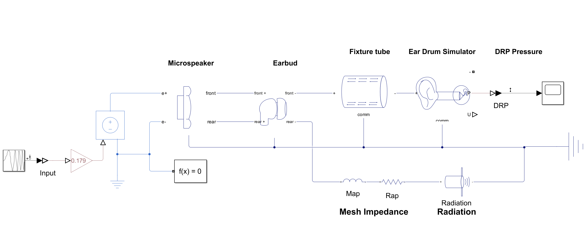
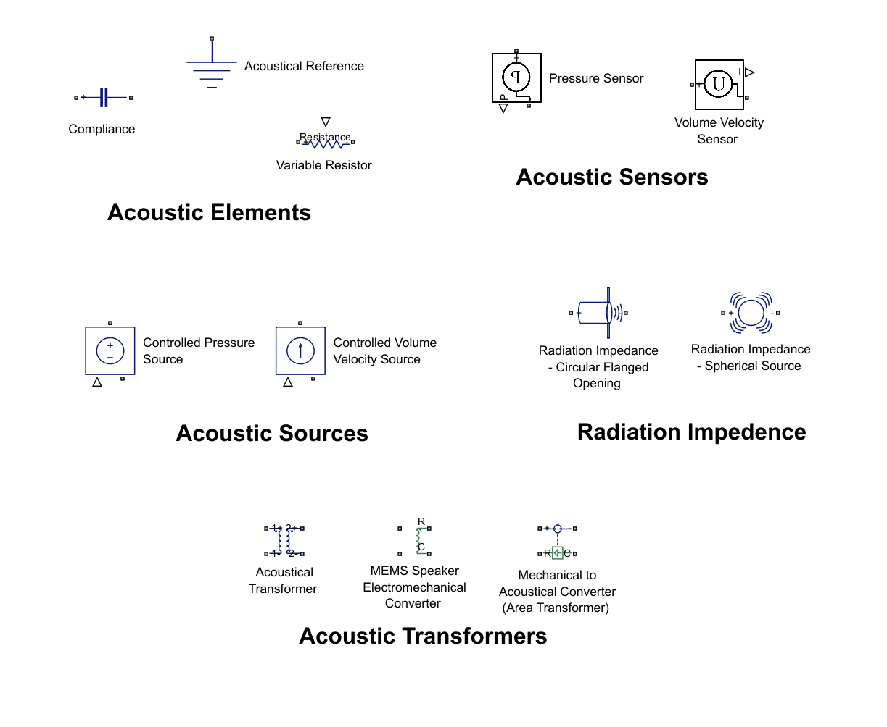
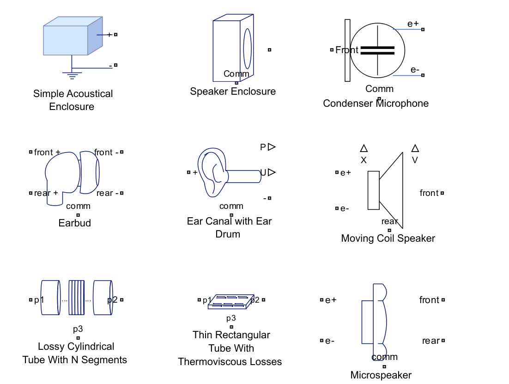
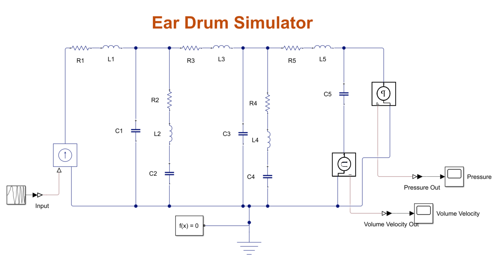
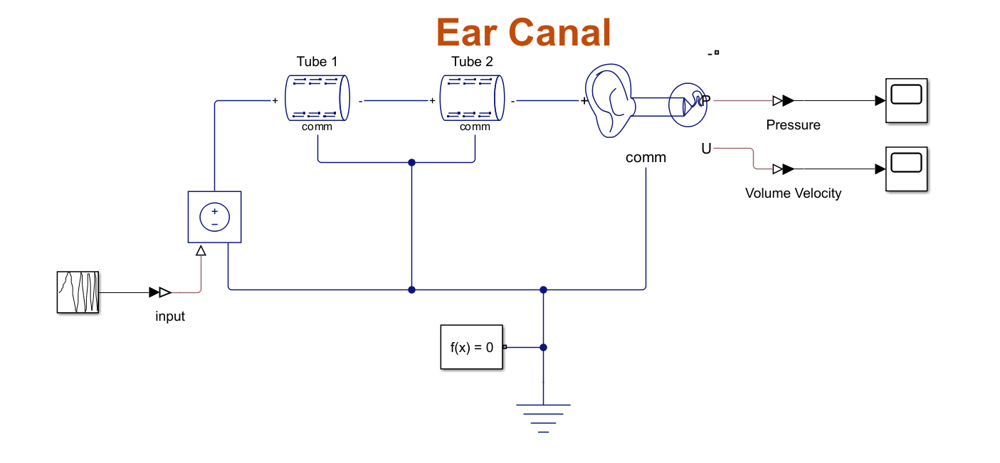
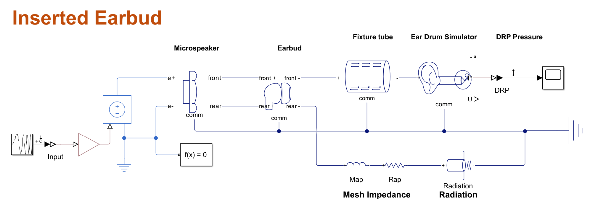
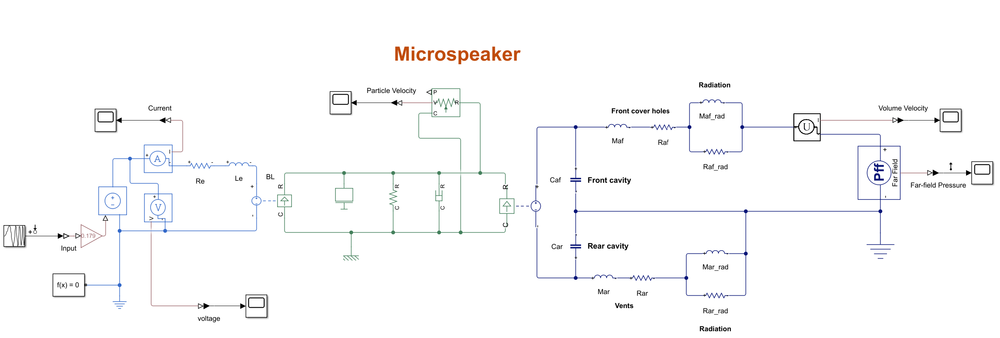
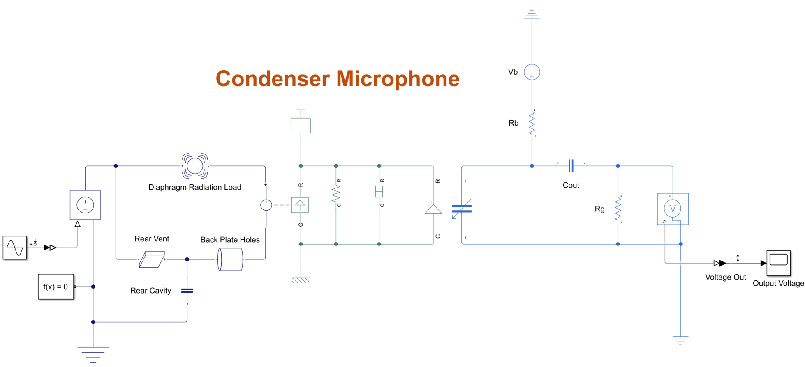

# Acoustic Library for Simscape™

## Overview
The Acoustic Library enables the simulation of acoustical transmission lines, loudspeakers, piezoelectric components, and other acoustic systems. 

The core concept is to model acoustics using lumped parameter systems, which are analogous to simple RLC electrical circuits. Most components in the library are built upon these lumped parameter models.

The acoustic library also includes components beyond the simple lumped elements. These include several kinds of acoustical transmission lines, piezoelectric pieces, and assemblies of simpler components such as approximate models for radiation impedance and several models of moving coil speakers.

Below is a screenshot of an inserted ear bud model modeled using the acoustic library.

A valuable reference on this topic is Acoustics: Sound Fields, Transducers, and Vibrations by Beranek and Mellow. 

MathWorks extends its gratitude to Dr. Steve Thompson for his contributions in developing this library, which is based on his earlier release, Acoustical Domain for Simscape, on File Exchange. 

For support and inquiriess, please contact: Francis Tiong ftiong@mathworks.com

## Folder structure
The library is organized into two main sections: Foundation and Applications. 

The Foundation section includes fundamental components for modeling acoustic systems, categorized into five subfolders -- Elements, Sources, Sensors, Radiation Impedance, and Transformers. 

Below is a screenshot of selected fundamental components.

The Applications section contains composite components tailored for various acoustic applications, such as loudspeakers, microphones, tubes, enclosures, and more. New applications will be added to this section when they are available.

Below is a screenshot of selected application components.

## How to get started
Unzip the downloaded file, change workspace directory to the library folder and run acousticLibSetup.m. 
1, Unzip the downloaded file SimscapeAudioLib.zip
2, >>cd SimscapeAudioLib 
3, >>acousticLibSetup

Linux and Mac users should regenerate the library. See the commands in acousticLibSetup on how to regenerate the library.

## Examples
There are a few examples included but are not considered to be part of the acoustic library:
1. 	**Ear Drum Impedance (IEC 60318-4 Coupler)** -- The "Ear Drum Impedance" component models the response of an average human ear, incorporating the lumped element impedance of both the eardrum and a portion of the ear canal. This model follows the IEC 60318-4 Standard (formerly IEC 60711), which defines the typical human ear response up to 10 kHz. It can be integrated with other acoustic models to simulate physical measurement conditions, such as testing inserted earbuds. In consumer audio device evaluations, fixtures that replicate human hearing are often used, and this model provides a more accurate response.
   

2. 	**Physical Human Ear canal** -- This model represents the human ear canal using two cascaded cylindrical tubes with thermo-viscous losses, connected in series with the "Ear Drum Impedance" component. 
   

3. **Inserted Earbud** -- The earbud is divided by the microspeaker into the front and rear cavities. In the schematic, all vents and leaks are modeled as small cylindrical tubes, represented by a series connection of an inductor (air mass) and a resistor (air resistance). The sound tube and ear tip are also modeled as cylindrical tubes, accounting for thermal-viscous losses. The rear cavity of the earbud is modeled as a capacitor, representing the lumped air compliance.
   

4. **Microspeaker** -- Miniature speakers are widely used as drivers in commercial headphones and earbuds. While the core technology remains based on the voice coil speaker, microspeakers incorporate additional acoustic elements. The model assumes the microspeaker is mounted on an infinite baffle, with pressure response measured in the far-field under free-space conditions, where there is no reflection.
   

5. **Condenser Microphone** -- This model simulates the response of a typical condenser microphone. The microphone consists of the mechanical properties of the membrane, the air gap between the membrane and the back plate, back plate with holes and slot, rear cavity and rear vent. The model includes a variable-gap capacitor from the Simscape Electrical library to simulate the dynamic interaction between the diaphragm and the backplate.

## MATLAB Release Compatibility
This library was created with MATLAB R2024a. It is compatible with R2024a and later releases. 

## License
The license is available in the License.txt file in this GitHub repository.

## Relevant Industries
loudspeaker design, microphone design, earphone design, balanced armature driver, vibration sensor, hydrophones, acoustic transducers, ultrasonic transducers

## Relevant Products
 *  MATLAB®
 *  Simulink® 
 *  Simscape™
 *  Audio Toolbox™ 

Copyright 2025 The MathWorks, Inc.
